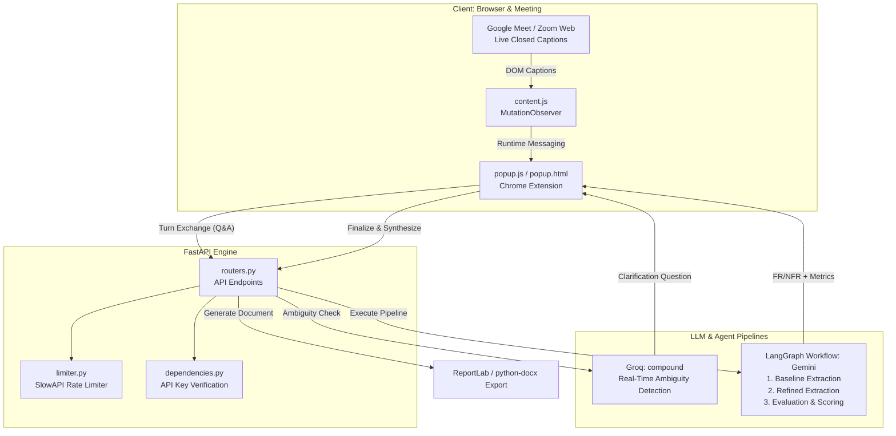

# AI Requirement Engineering Assistant

An end-to-end, real-time AI assistant for software requirements elicitation during stakeholder meetings (Google Meet, Zoom Web). 

The tool continuously monitors spoken dialogue, detects ambiguous or incomplete statements on-the-fly, prompts stakeholders with targeted clarification questions, and synthesizes testable Functional Requirements (FR) and categorized Non-Functional Requirements (NFR) through a multi-agent LangGraph workflow.

---

## Architecture Overview



---

## Key Features

1. **Live Caption Scraping**:
   - Integrates with Google Meet and Zoom Web via a Manifest V3 Content Script.
   - Monitors caption elements via `MutationObserver` and streams transcript lines to the extension in real time.

2. **Real-Time Ambiguity Detection**:
   - Uses **Groq** for sub-second inference latency.
   - Identifies vague, subjective, or non-quantified terminology (e.g., *"quick"*, *"secure enough"*, *"soon"*).
   - Formulates precise clarification questions and surfaces them as interactive cards.

3. **Dialogue Cycle Buffering & In-Flight Guard**:
   - Batches conversational statements into speaker Q&A pairs to respect LLM rate limits without missing critical stakeholder answers.
   - Built-in in-flight locking prevents concurrent request collisions.

4. **Multi-Stage LangGraph Synthesis Pipeline**:
   - **Node 1 (Baseline Extraction)**: Extracts raw, unclarified FR and NFRs directly from the transcript.
   - **Node 2 (Refined Extraction)**: Integrates stakeholder clarification responses to produce unambiguous, quantified parameters.
   - **Node 3 (Evaluation & Comparison)**: Computes comparative metrics between baseline and refined requirements:
     - **Ambiguity Score** (Scale: 1–10)
     - **Completeness Score** (%)
     - **Verifiability Score** (%)

5. **State Persistence**:
   - Backed by `chrome.storage.local` to prevent loss of transcripts, clarification cards, or synthesized reports when closing/reopening the popup.

6. **Multi-Format Document Export**:
   - One-click export of structured requirement specifications into **PDF** (ReportLab), **Word Document** (`.docx`), or plain text (`.txt`).

---

## Project Structure

```
├── Backend/
│   ├── main.py              # FastAPI application entrypoint with CORS & error handlers
│   ├── routers.py           # API endpoints (/analyze-turn, /synthesize, /export)
│   ├── services.py          # LangGraph state graph & prompt engineering
│   ├── schemas.py           # Pydantic request/response models & TypedDict state
│   ├── llms.py              # Model initializations (Groq & Gemini) + SSL configuration
│   ├── dependencies.py      # Header-based API key validation
│   ├── limiter.py           # SlowAPI rate limiter instance
│   ├── requirements.txt     # Python dependencies
│   └── .env.example         # Template for environment credentials
├── Frontend/
│   ├── manifest.json        # Chrome Extension Manifest V3 configuration
│   ├── popup.html           # Extension user interface layout
│   ├── popup.js             # Client logic, state management, and API orchestration
│   ├── content.js           # Meeting DOM scraper for Google Meet / Zoom
│   └── styles.css           # Modern interface styling
├── .gitignore               # Excludes secrets, venvs, caches, and large media
└── README.md
```

---

## Getting Started

### Prerequisites
- Python 3.10 or higher
- Google Chrome (or any Chromium-based browser)
- A [Groq API Key](https://console.groq.com)
- A [Google Gemini API Key](https://aistudio.google.com)

---

### 1. Backend Setup

1. **Navigate to the Backend directory**:
   ```bash
   cd Backend
   ```

2. **Create and activate a virtual environment**:
   ```bash
   # Windows
   python -m venv venv
   .\venv\Scripts\activate

   # macOS / Linux
   python3 -m venv venv
   source venv/bin/activate
   ```

3. **Install dependencies**:
   ```bash
   pip install -r requirements.txt
   ```

4. **Set up Environment Variables**:
   Copy `.env.example` to `.env`:
   ```bash
   cp .env.example .env
   ```
   Open `.env` and fill in your keys:
   ```env
   GROQ_API_KEY=your_groq_api_key_here
   GOOGLE_API_KEY=your_google_gemini_api_key_here
   API_KEY=default-secret-key
   ```

5. **Start the FastAPI Server**:
   ```bash
   python main.py
   ```
   The backend will start at `http://127.0.0.1:8000`.

---

### 2. Frontend (Chrome Extension) Setup

1. Open Google Chrome and navigate to:
   ```
   chrome://extensions
   ```
2. Enable **Developer mode** (toggle in the top right corner).
3. Click **Load unpacked**.
4. Select the `Frontend/` folder from this repository.
5. The **AI Requirement Engineering Assistant** icon will now appear in your browser extensions bar. Pin it for quick access.

---

## How to Use

### Mode A: Automated Simulation (Sample Script)
1. Open the Chrome extension popup.
2. Under the **Live Meeting Assistant** tab, click **Load Sample Meeting**.
3. A 20-line requirements dialogue will simulate live speaker turns.
4. When ambiguous statements occur, clarification cards will appear dynamically under **Live Clarifications**.
5. Type stakeholder answers into the input fields and click **Submit Response**.
6. Once the conversation is complete, click **Finalize & Synthesize Requirements**.
7. View the synthesized Functional & Non-Functional Requirements alongside comparative evaluation scores, or click **Export as PDF / Word / TXT**.

### Mode B: Live Google Meet or Zoom
1. Join a meeting on **Google Meet** or **Zoom Web**.
2. Turn on **Closed Captions (CC)** in the meeting interface.
3. Open the extension popup; live speaker captions will stream directly into the feed.
4. Answer clarification prompts as they arise and synthesize when ready.

---

## License
Distributed under the MIT License. See `LICENSE` for more information.
